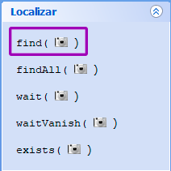

# Tutorial Sikulix

[Sikulix](http://sikulix.com/) é uma ferramenta para automatizar testes, simulando a interação do usuário com o programa, através de capturas de tela.

O Sikulix é capaz de ações mais complexas do que apresentadas neste tutorial; este é apenas um guia básico para criar testes para formulários.

## Sumário

- Download
- IDE
- Formulário de exemplo
- Teste
- Funções mais usadas
- Caracteres especiais
- Rodar o teste
- Nomear arquivos
- Resolução

## Download

[Sikulix](https://drive.google.com/file/d/1UooBDQf2N6C4BVDAuOhKvJWbvFHgvBlS/view?usp=sharing)

## IDE

###### IDE do Sikulix

## Formulário de exemplo

###### Formulário de cadastro de Produto

## Teste

###### Menu IDE Sikuli

### Script de teste

find(  )

click(  )

find(  )

click(  )

wait(  )

find(  )

click(  )

type('tiara')

find(  )

click(  )

type('06')

find(  )

click(  )

type('123')

find(  )

click(  )

type('531826')

find(  )

click(  )

type('11112011')

find(  )

click(  )
type('11112022')

find(  )
click(  )
type('06062018')

find(  )
click(  )
type(Key.DOWN + Key.ENTER)

find(  )
click(  )

Este teste clica Em _Produto_ no menu, seleciona a opção _Cadastrar_, preenche todos os campos do formulário Produto, seleciona um fornecedor e clica na opção _Cadastrar_.

## Funções mais usadas

A IDE do Sikuli oferece a inserção de funções com apenas um clique. Entretanto, elas podem ser digitadas normalmente.

Para uma função que exige imagem, após digitá-la, o usuário deve usar o botão _Captura imagem da tela_ para abrir a ferramenta que o permitirá criar um retângulo na região que deseja usar. Como alternativa, o usuário pode usar uma imagem já capturada (a imagem deve estar salva na mesma pasta do script) e usar o nome da imagem dentro de parêntesis seguido da extensão do arquivo (.png, .jpg, etc).

Exemplo: find("imagem.png")

### Find

No menu à esquerda da IDE, na área de Localizar, a função _find()_ é usada para encontrar um objeto na tela do computador. Ao clicar no botão para inserir a função, a IDE abre automaticamente a ferramenta de captura de tela.

###### Função _find()_

Arraste o mouse para criar um retângulo no objeto que deseja ser encontrado pelo Sikuli.

### Click e Double Click

No menu à esquerda da IDE, na área de _Ação do mouse_, a função _click()_ é usada para criar uma ação de clique.

###### Função _click()_

A função _doubleClick()_ é usada para criar uma ação de clique duplo.

###### Inserir função _doubleClick()_

Ao clicar no botão para inseri-las, ambas as funções abrem automaticamente a captura de tela. Arraste o mouse para criar um retângulo no objeto que deseja ser encontrado pelo Sikuli.

Ao capturar a imagem, uma cruz vermelha aparecerá indicando o centro da imagem; durante o teste, o Sikuli clicará onde é indicado pelo centro desta cruz vermelha. Para editar onde o Sikuli deve clicar, clique na imagem, selecione _Desvio do alvo_ no menu superior, clique onde deve ser clicado na imagem e, em seguida, clique em _Aplicar_, depois _Ok_.

### Wait

A função _wait()_ serve para fazer o Sikuli esperar algum elemento aparecer na tela antes de continuar o teste do script. Pode ser encontrada em _Localizar_, no menu ao lado esquerdo da IDE.

Inserir função _wait()_

### Type

A função _type()_ pode ser encontrada no menu à esquerda da IDE. É usada para fazer o Sikuli inserir texto. O texto dentro da função deve estar envolto de aspas.

Exemplo: type(*"texto"*) ou type(*'texto'*)

###### Inserir função _type()_

## Caracteres especiais

Caracteres especiais devem ser usados dentro da função _type()_ sem aspas. O sinal de mais (*+*) concatena ações. Para combinar teclas, a vírgula (*,*) é usada.

Exemplos:
type(**Key.DOWN** + **Key.ENTER**)
###### Realiza a ação de seta para baixo seguido da tecla enter.

type(**','**, **Key.SHIFT**)
###### Simula segurar a tecla SHIFT e apertar a vírgula. Digita o símbolo de menor: <

O uso de caracteres especiais podem ser encontrados na documentação:
[Special Keys](http://doc.sikuli.org/keys.html#special-keys)

## Rodar o teste

Para rodar o teste, é necessário salvar o arquivo primeiro (Arquivo > Salvar) e, então, clicar em _Executar_ no menu superior.

###### Clicar no botão Executar para rodar o teste

### Mensagens de alerta

Após o teste ser bem sucedido ou não, o script gera um relatório na caixa de mensagens no inferior da IDE.

###### Exemplo de relatório mal sucedido.

O texto vermelho indica que não foi possível encontrar o elemento pedido em determinada região.

Caso o teste seja bem sucedido, o relatório retorna em letras verdes e descreve as ações que foram feitas pelo script e seu tempo de duração. O resultado do script a seguir é clicar no ícone do Bloco de notas e digitar em sua caixa de texto: '<'.

###### Mensagem de teste bem sucedid.

## Nomear arquivos

Os arquivos do Sikulix não suportam acentos, portanto, não devem ser utilizados quando salvar arquivos.

## Resolução

Um teste feito em um computador com uma determinada resolução, pode não funcionar em outro computador com uma resolução diferente.

## Recursos

Para mais funcionalidades do Sikuli, a documentação oficial está disponível em inglês:
- [Sikuli Documentation](http://doc.sikuli.org/)
